# Architecture

Video2SOP is a local single-user application. Uploaded videos, extracted frames, OCR artifacts, intermediate JSON artifacts, and generated DOCX files all stay on the local filesystem unless the user chooses to publish the code separately.

The current architecture reflects the last two rounds of product-quality work:

- public-repo safety for code publishing
- adaptive local segmentation for screen understanding
- chronology-first SOP cleanup and quality scoring

## High-Level System

The system has three layers:

1. `Streamlit UI`
   Accepts uploads, process metadata, quality profile selection, and shows final diagnostics.
2. `Worker pipeline`
   Runs frame extraction, segmentation, OCR, generation, verification, cleanup, and DOCX export.
3. `Local storage`
   Uses the filesystem for artifacts and SQLite for lightweight job state tracking.

## End-To-End Flow

```mermaid
flowchart LR
    A["Streamlit upload"] --> B["SQLite job record"]
    B --> C["Worker thread"]
    C --> D["Dense frame extraction"]
    D --> E["Adaptive boundary detection"]
    E --> F["Screen-state segmentation"]
    F --> G["OCR and rule-based classification"]
    G --> H["Segment enrichment and pruning"]
    H --> I["GPT generation or local fallback"]
    I --> J["Risk verification"]
    J --> K["Validation"]
    K --> L["Deterministic SOP cleanup"]
    L --> M["Chronology-safe phase sections"]
    M --> N["DOCX export"]
```



## Main Modules

- [app.py](<G:/My Drive/Video-to-SOP/app.py>)
  Streamlit UI. Handles upload, metadata capture, profile selection, cost estimate display, job progress, final diagnostics, and DOCX download.

- [worker.py](<G:/My Drive/Video-to-SOP/worker.py>)
  Main orchestration layer. Reads job metadata, runs the pipeline, writes artifacts, exports the DOCX, and updates SQLite status.

- [storage/jobs.py](<G:/My Drive/Video-to-SOP/storage/jobs.py>)
  SQLite schema and CRUD helpers for job records.

- [pipeline/config.py](<G:/My Drive/Video-to-SOP/pipeline/config.py>)
  Defines `QualityProfile`, profile presets, model defaults, pricing defaults, and rough cost estimation.

- [pipeline/video.py](<G:/My Drive/Video-to-SOP/pipeline/video.py>)
  Extracts resized frames, computes local image signatures, and provides lower-level image helpers used by segmentation.

- [pipeline/segmentation.py](<G:/My Drive/Video-to-SOP/pipeline/segmentation.py>)
  Dense metric computation, adaptive thresholding, screen-state clustering, OCR-backed segment enrichment, scroll collapse, and optional GPT review of ambiguous boundaries.

- [pipeline/ocr.py](<G:/My Drive/Video-to-SOP/pipeline/ocr.py>)
  Native Tesseract detection, OCR preprocessing, OCR execution, and OCR fallback behavior.

- [pipeline/clean_ocr.py](<G:/My Drive/Video-to-SOP/pipeline/clean_ocr.py>)
  Removes UI noise from OCR text while preserving business-relevant terms.

- [pipeline/classify.py](<G:/My Drive/Video-to-SOP/pipeline/classify.py>)
  Rule-based system classification for SAP, Excel, Email, Slack/Teams, Browser, PDF, File Explorer, and Other.

- [pipeline/generate.py](<G:/My Drive/Video-to-SOP/pipeline/generate.py>)
  Bounded batched step generation from event segment evidence, with local fallback if OpenAI is unavailable or returns unusable output.

- [pipeline/verify.py](<G:/My Drive/Video-to-SOP/pipeline/verify.py>)
  Risk detection and conservative verification of only the riskiest steps.

- [pipeline/validate.py](<G:/My Drive/Video-to-SOP/pipeline/validate.py>)
  Pre-cleanup validation and chronology-safe phase section rendering.

- [pipeline/sop_cleanup.py](<G:/My Drive/Video-to-SOP/pipeline/sop_cleanup.py>)
  Deterministic last-mile quality layer. Handles noise removal, passive review cleanup, conservative merging, chronology validation and repair, phase inference, and quality scoring.

- [pipeline/docx_export.py](<G:/My Drive/Video-to-SOP/pipeline/docx_export.py>)
  Generates the Word document, embeds screenshots, renders repeated timeline phase sections, and adds cleanup and metadata appendices.

## Worker Contract

The worker currently runs this sequence:

1. Read the job record and selected quality profile.
2. Extract dense frames using the profile's metric interval.
3. Build adaptive boundary candidates and event segments.
4. Run OCR on bounded evidence frames.
5. Generate SOP steps from event segments.
6. Verify risky steps.
7. Validate step schema and system consistency.
8. Run deterministic SOP cleanup.
9. Render the final DOCX from cleaned steps only.
10. Update the SQLite job record with segmentation diagnostics, cleanup metrics, and readiness.

## Data Model Highlights

### Job Metadata

The UI and DOCX consume values from `meta_json` in the SQLite job record. Current fields include:

- process metadata:
  - `filename`
  - `process_name`
  - `department_notes`
  - `target_audience`
- selected profile:
  - `quality_profile`
- pricing:
  - `cost_estimate`
- pipeline counts:
  - `frames`
  - `screen_states`
  - `boundary_candidates`
  - `events`
  - `ocr_frames`
  - `steps`
  - `original_steps`
  - `cleaned_steps`
  - `removed_steps`
  - `merged_steps`
- quality:
  - `quality_score`
  - `readiness`
  - `cleanup_report`
  - `phase_summary`
- segmentation diagnostics:
  - `segmentation.screen_states`
  - `segmentation.boundary_candidates`
  - `segmentation.event_segments`
  - `segmentation.threshold`
- optional runtime flags:
  - `fallback`
  - `warnings`

### Event Segments

The segmentation layer now produces event-centric evidence rather than frame-only selections. Segment records can contain:

- `start_time_sec`
- `end_time_sec`
- `before_frame`
- `entry_frame`
- `stable_frame`
- `after_frame`
- `boundary_score`
- `screen_state_id`
- `system`
- `ocr_text`
- `ocr_delta`
- `action_hint`
- `confidence_components`

### Cleanup Metadata

Cleanup normalizes step ordering metadata so chronology can be validated and repaired deterministically:

- `original_step_number`
- `source_event_index`
- `start_time_seconds`
- `end_time_seconds`
- `screen_state`

## Storage Layout

```text
jobs/{job_id}/
  input.mp4
  sop.docx
  frames/
  ocr/
  artifacts/
    frames.json
    frame_metrics.json
    boundary_candidates.json
    screen_states.json
    event_segments.json
    segmentation_report.md
    ocr_raw.json
    events.json
    steps_generated.json
    steps_validated.json
    sop_cleanup.json
    steps_final.json
```

SQLite database:

```text
storage/jobs.sqlite3
```

## UI Diagnostics

After a job completes, the Streamlit UI reads job metadata and displays:

- final step count
- original step count
- cleaned step count
- removed count
- merged count
- quality score
- readiness label
- chronology validity and pre-cleanup violation count
- screen states
- boundary candidates
- event segments
- adaptive boundary threshold when available

## Safety Model

This repository is intended to be safe for public GitHub use if local secrets and generated artifacts stay ignored.

Key files:

- [.gitignore](<G:/My Drive/Video-to-SOP/.gitignore>)
- [.env.example](<G:/My Drive/Video-to-SOP/.env.example>)

Ignored paths include:

- `jobs/`
- `storage/*.sqlite3`
- `*.log`
- `.env`
- `.env.*`
- `.streamlit/secrets.toml`
- Python caches
- local virtual environments

## Failure Behavior

The system is designed to degrade rather than crash when possible.

- Missing Tesseract:
  OCR text stays empty, but segmentation, fallback generation, cleanup, and DOCX export continue.

- OpenAI unavailable:
  Step generation and verification fall back locally.

- Model JSON failure:
  The affected batch falls back to deterministic local step wording.

- Cleanup removes most weak steps:
  The report can mark the SOP as `not_ready` instead of pretending the result is strong.

- Chronology arrives out of order:
  Cleanup repairs ordering automatically and records the issue in the quality report.

- Late pipeline failure:
  The worker tries to produce a fallback DOCX from already-generated event artifacts.
