# Architecture

Video2SOP is a local single-user application. It keeps all uploaded videos, extracted frames, intermediate artifacts, and generated DOCX files on the local filesystem.

## High-Level Flow

```mermaid
flowchart LR
    A["Streamlit upload"] --> B["SQLite job record"]
    B --> C["Worker thread"]
    C --> D["Frame extraction"]
    D --> E["Representative frame selection"]
    E --> F["OCR and cleaning"]
    F --> G["System classification"]
    G --> H["Event clustering and pruning"]
    H --> I["GPT generation or local fallback"]
    I --> J["Risk verification"]
    J --> K["Validation and phase grouping"]
    K --> L["DOCX export"]
```



## Main Components

- `app.py`: Streamlit UI, process metadata, quality profile selection, cost estimate, upload handling, job status, and DOCX download.
- `worker.py`: Executes the pipeline for one job and writes artifacts.
- `storage/jobs.py`: SQLite job creation, updates, and listing.
- `pipeline/config.py`: Quality profiles, model defaults, and rough cost estimation.
- `pipeline/video.py`: Frame extraction, visual diff scoring, image hashes, and representative selection.
- `pipeline/ocr.py`: OCR preprocessing and Tesseract execution with graceful fallback.
- `pipeline/cluster.py`: Candidate event creation, duplicate filtering, action hints, and screenshot context.
- `pipeline/generate.py`: Batched GPT step generation with local fallback.
- `pipeline/verify.py`: Risk detection and conservative verification.
- `pipeline/validate.py`: Deduplication, system mismatch correction, max-step enforcement, and phase grouping.
- `pipeline/docx_export.py`: Word document generation.

## Storage Layout

```text
jobs/{job_id}/
  input.mp4
  sop.docx
  frames/
  ocr/
  artifacts/
    frames.json
    selected_frames.json
    ocr_raw.json
    classified.json
    events.json
    steps_generated.json
    steps_final.json
```

SQLite lives at:

```text
storage/jobs.sqlite3
```

## SQLite Job Record

Each job stores:

- `id`
- `status`: `queued`, `running`, `complete`, or `failed`
- `progress`
- `message`
- `input_path`
- `output_path`
- `error`
- `meta_json`
- `created_at`
- `updated_at`

`meta_json` contains process metadata, profile settings, cost estimate, warnings, and final counts.

## Failure Behavior

Video2SOP is designed to produce some SOP whenever enough evidence exists.

- Missing Tesseract: OCR text is empty, but frames still continue through classification, GPT vision, and fallback generation.
- OpenAI unavailable: local fallback steps are generated.
- Model JSON failure: the batch falls back locally.
- Late pipeline failure: worker attempts to build a fallback DOCX from already-created event artifacts.
- Very weak evidence: the DOCX includes warnings and low confidence rather than invented steps.
